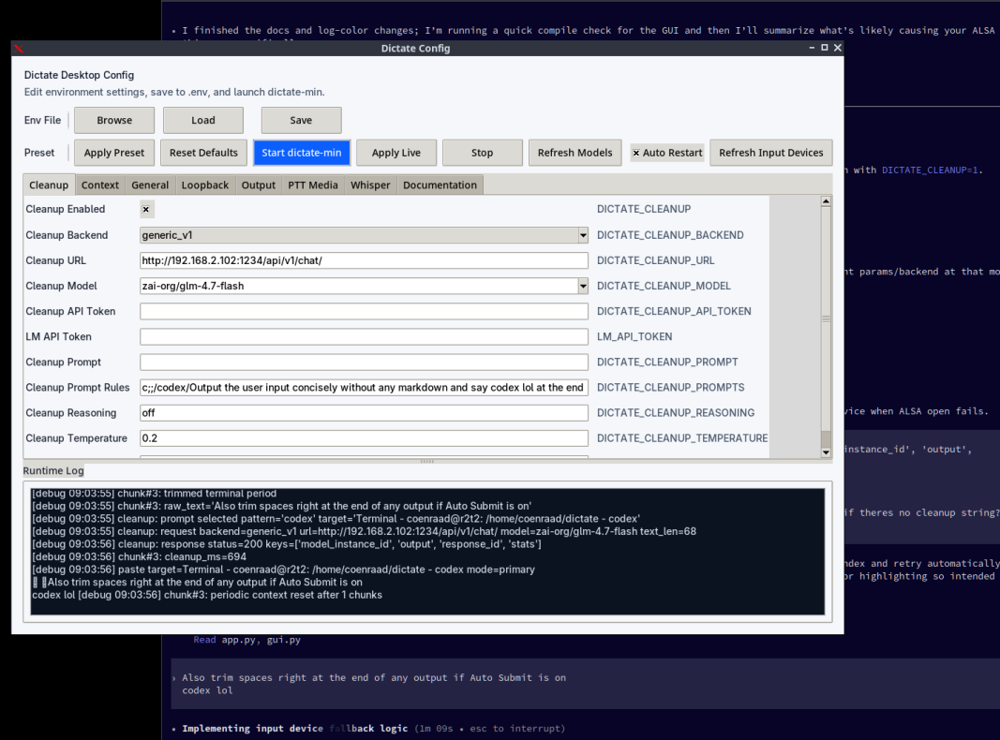

# dictate-min



Minimal push-to-talk dictation clone (Linux/macOS).

## Quick Start

### Desktop GUI (recommended)

```bash
python3 -m venv .venv
source .venv/bin/activate
pip install -e .
python3 gui.py
```

### CLI

```bash
dictate-min
```

### List Input Devices

```bash
dictate-min --list-input-devices
```

## GUI

- `gui.py` is a desktop configuration UI (`tkinter/ttk`, no extra GUI dependencies).
- Features:
  - grouped env controls (toggles, dropdowns, text fields)
  - preset profiles
  - input device dropdowns (`Refresh Input Devices`)
  - model dropdowns (`Refresh Models`) for STT and cleanup backends
  - live runtime apply while `dictate-min` is running
  - optional auto-restart for restart-required settings (`Auto Restart`, enabled by default)
- Live runtime updates are written to `.dictate-runtime.env` and consumed via `DICTATE_RUNTIME_ENV_FILE`.

## Controls

- Hold configured PTT key (default `Right Ctrl`) to record.
- Release to transcribe and paste into the active app.
- `Ctrl+C` to quit.

## Environment variables

### General
- `DICTATE_MODE`: `ptt` or `loopback` (default `ptt`)
- `DICTATE_INPUT_DEVICE`: numeric sounddevice input index (optional)
- `DICTATE_INPUT_DEVICE_NAME`: case-insensitive input-name substring match (used when `DICTATE_INPUT_DEVICE` is unset)
- `DICTATE_SAMPLE_RATE`: input sample rate hint (default `16000`, auto-falls back if unsupported)
- `DICTATE_PASTE`: `1` or `0` (default `1` in `ptt`, `0` in `loopback`)
- `DICTATE_PASTE_MODE`: `clipboard`, `type`, `primary` (default `type` on Linux, `clipboard` otherwise)
  - invalid values fall back to `clipboard`
- `DICTATE_PASTE_PRIMARY_CLICK`: for `primary` mode on Linux, trigger middle-click paste after setting PRIMARY selection (default `1`)
- `DICTATE_PASTE_PRESERVE`: preserve and restore prior clipboard/selection text around paste in `clipboard`/`primary` modes (default `1`)
- `DICTATE_PASTE_RESTORE_DELAY_MS`: delay before restoring clipboard after paste to avoid race with target app (default `80`)
- `DICTATE_DEBUG`: `1` for verbose runtime diagnostics (default `0`)
- `DICTATE_DEBUG_KEYS`: `1` to log every key press/release and whether it matches PTT (default `0`)
- `DICTATE_FILE_LOG`: `1` to append runtime/model/output events to `YYYYMMDD.log` (default `1`)
- `DICTATE_RUNTIME_ENV_FILE`: optional path to a runtime `.env` overrides file polled while running for hot updates (default disabled)
  - hot-reloadable: debug flags, most cleanup settings, `DICTATE_PTT_AUTO_PAUSE_MEDIA`, ducking settings, `DICTATE_PTT_AUTO_SUBMIT`, `DICTATE_CONTEXT_RESET_EVERY`, `DICTATE_TRIM_CHUNK_PERIOD`, `DICTATE_LOOP_GUARD`
  - restart-required: mode/device/STT engine settings, paste transport settings, and most audio pipeline geometry settings

### Push-to-talk mode
- `DICTATE_PTT_KEY`: `cmd_r`, `super_r`, `cmd_l`, `super_l`, `super`, `win`, `shift_r`, `shift_l`, `ctrl_l`, `ctrl_r`, `alt_l`, `alt_r` (default `ctrl_r`)
- `DICTATE_PTT_AUTO_PAUSE_MEDIA`: on PTT press, run `playerctl -a pause` to pause media playback (Linux, default `1`)
- `DICTATE_PTT_DUCK_MEDIA`: on PTT press, lower default sink volume and restore it on release (Linux, default `0`)
- `DICTATE_PTT_DUCK_SCOPE`: duck target scope when ducking is enabled: `default` or `all` (ducks all non-monitor sinks) (default `default`)
- `DICTATE_PTT_DUCK_MEDIA_PERCENT`: target volume while PTT is held when ducking is enabled (default `30`)
- `DICTATE_PTT_AUTO_SUBMIT`: press Enter after emitting a PTT chunk; hold Shift while releasing PTT to suppress for that chunk (default `0`)
- On Linux PTT release, only players that were playing on press (and are paused at release) are resumed.
- If both ducking and auto-pause are enabled, ducking takes precedence on PTT press.

### Loopback mode
- `DICTATE_LOOPBACK_CHUNK_S`: chunk size in seconds (default `4`)
- `DICTATE_LOOPBACK_HINT`: fallback name hint for non-pulse auto-pick (default `loopback pcm`)
- `DICTATE_PULSE_SOURCE`: force pulse source name, e.g. `jamesdsp_sink.monitor`
- `DICTATE_MIN_CHUNK_RMS`: skip near-silent chunks below threshold (default `0.0008`)

### Cleanup model
- `DICTATE_CLEANUP`: enable cleanup pass (`1`/`0`, default `1`)
- `DICTATE_CLEANUP_BACKEND`: cleanup backend: `ollama` (default) or `generic_v1` (`api_v1`/`lm_api_v1` aliases)
- `DICTATE_CLEANUP_URL`: cleanup endpoint URL (defaults to `DICTATE_OLLAMA_URL` if set, else `http://localhost:11434/api/chat`)
  - for `generic_v1`, if this is just a base URL like `http://host:1234`, app auto-uses `http://host:1234/v1/chat`
- `DICTATE_CLEANUP_MODEL`: cleanup model name (defaults to `DICTATE_OLLAMA_MODEL`; auto-pick for `ollama` when empty; for `generic_v1`, attempts discovery from `/api/v1/models` or `/v1/models` and picks a single loaded model, else a single available model)
- `DICTATE_CLEANUP_API_TOKEN`: bearer token for cleanup backend auth (or set `LM_API_TOKEN`)
- `DICTATE_CLEANUP_PROMPT`: system prompt for cleanup model (default: "You are a dictation post-processor. Fix punctuation and capitalization only. Do not add ideas. Output only corrected text.")
- `DICTATE_CLEANUP_PROMPTS`: slash-rule overrides by active window title, format: `/match/prompt,/other/prompt2` or `/match/prompt ;; /other/prompt2 ;; default prompt`
  - matching is case-insensitive substring against active window title
  - if multiple rules match, only the last matching rule is sent
  - if none match, the default prompt is used (when provided in `;; default prompt` form), else `DICTATE_CLEANUP_PROMPT`
  - if no rule matches and the resolved default prompt is empty, cleanup is skipped (no cleanup model request is sent) even when `DICTATE_CLEANUP=1`
  - prompt templates support placeholders:
    - current: `{input}`, `{target}`, `{backend}`, `{model}`
    - previous single: `{prev_input}`, `{prev_output}`, `{prev_prompt}`
    - previous indexed (most recent first): `{prev_input_1}`, `{prev_input_2}`, `{prev_output_1}`, `{prev_prompt_1}`, etc.
    - full buffer (joined by newlines): `{buffer_inputs}`, `{buffer_outputs}`, `{buffer_prompts}`
  - example: `DICTATE_CLEANUP_PROMPTS="/terminal/Output only shell-safe text. Keep commands exact.,/code/Preserve code tokens exactly; only fix punctuation around prose."`
- `DICTATE_CLEANUP_REASONING`: for `generic_v1` payloads (default `off`)
- `DICTATE_CLEANUP_TEMPERATURE`: for `generic_v1` payloads (default `0.2`)
- `DICTATE_CLEANUP_HISTORY_SIZE`: number of prior cleanup exchanges kept for template placeholders (default `12`)
- `DICTATE_OLLAMA_URL` / `DICTATE_OLLAMA_MODEL`: legacy compatibility aliases still supported

### Whisper-specific

#### STT model + decoding
- `DICTATE_STT_MODEL`: faster-whisper model, e.g. `tiny`, `small`, `medium.en` (default `medium.en`)
- `DICTATE_STT_DEVICE`: `cpu`, `auto`, `cuda` (default `auto`)
- `DICTATE_STT_COMPUTE`: e.g. `int8`, `float16` (default auto: `float16` for `auto/cuda`, `int8` for `cpu`)
- `DICTATE_STT_CONDITION_PREV`: maps to `condition_on_previous_text` (default `0`)
- `DICTATE_STT_BEAM_SIZE`: beam size (default `5`)
- `DICTATE_STT_NO_SPEECH_THRESHOLD`: no-speech threshold (default `0.6`)
- `DICTATE_STT_LOGPROB_THRESHOLD`: log-prob threshold (default `-1.0`)
- `DICTATE_STT_COMPRESSION_RATIO_THRESHOLD`: compression-ratio threshold (default `2.4`)
- `DICTATE_INPUT_LANGUAGE`: `auto` or language code (default `auto`)

#### Context + overlap
- `DICTATE_CONTEXT`: enable text context carryover (`1`/`0`, default `1`)
- `DICTATE_CONTEXT_CHARS`: max retained text context chars (default `600`)
- `DICTATE_CONTEXT_RESET_EVERY`: reset context every N emitted chunks (`0` disables, default `1`)
- `DICTATE_AUDIO_CONTEXT_S`: prepended previous-audio seconds per chunk (default `1.6`)
- `DICTATE_AUDIO_CONTEXT_PAD_S`: overlap pad used for timestamp clipping (default `0.12`)
- `DICTATE_STT_TAIL_PAD_S`: append trailing silence before Whisper decode to reduce end-of-chunk hallucinations (default `0.08`)
- `DICTATE_TRIM_CHUNK_PERIOD`: trim trailing `.`/`...` from chunk output (default `1`)

#### Loop/failure protection
- `DICTATE_LOOP_GUARD`: enable pathological-loop detection + context reset (default `1`)
- `DICTATE_LOOP_GUARD_REPEAT_RATIO`: repetition trigger ratio (default `0.55`)
- `DICTATE_LOOP_GUARD_PUNCT_RATIO`: punctuation-density trigger ratio (default `0.35`)
- `DICTATE_LOOP_GUARD_SHORT_RUN`: repeated short-token run trigger length (default `4`)
- `DICTATE_LOOP_GUARD_SHORT_LEN`: max token length considered “short” for run detection (default `3`)

## Notes

- STT is `faster-whisper` (works on Linux; no MLX required).
- Cleanup supports `ollama` and `generic_v1`-style backends.
- Legacy `DICTATE_OLLAMA_URL` / `DICTATE_OLLAMA_MODEL` are still accepted as compatibility aliases.
- Ollama is used for cleanup only (STT is not routed through Ollama in this app).
- If CUDA init fails, set `DICTATE_STT_DEVICE=cpu` explicitly for stable fallback.

## Troubleshooting

- ALSA/PortAudio stream-open failures like:
  - `Expression 'AlsaOpen(...)' failed`
  - `Expression 'PaAlsaStream_Initialize(...)' failed`
  typically mean PortAudio could see a device but could not open it with current capture parameters/backend routing.
- Common causes:
  - stale `DICTATE_INPUT_DEVICE` index after device reorder
  - loopback source/backend mismatch (`pulse` source not actually available at open time)
  - sample-rate/channel constraints on the selected source
  - transient device busy state during backend switch/restart
- Runtime behavior:
  - on stream-open failure, app now retries by refreshing a stale numeric device index from its current device name, then retries once with default input device
- Quick checks:
  - refresh device list: `dictate-min --list-input-devices`
  - prefer name-based selection: set `DICTATE_INPUT_DEVICE_NAME` and clear `DICTATE_INPUT_DEVICE`
  - in loopback mode, set `DICTATE_PULSE_SOURCE` explicitly to the active monitor source
  - if needed, set `DICTATE_SAMPLE_RATE` to the source native rate (often `48000`)

## Roadmap

### 1) Cross-Platform Refactor
- Split platform-specific code into adapters (audio routing, key hooks, paste, media control).
- Define a shared runtime core (`config`, `pipeline`, `state`, `events`) with platform modules:
  - `platform/linux.py`
  - `platform/macos.py`
  - `platform/windows.py`
- Remove Linux-specific assumptions from startup and runtime hot paths.
- Add feature-capability probing so unsupported features degrade gracefully per OS.

### 2) Cleanup Backend Expansion
- Keep current backends:
  - `ollama`
  - `generic_v1` (`/api/v1/chat` / `/v1/chat`)
- Add providers with first-class schema adapters:
  - OpenAI-compatible chat endpoints
  - Anthropic-style message APIs
  - Additional local gateways as adapter plugins
- Improve model discovery and selection policy:
  - prefer loaded model
  - support pinned model aliases
  - optional fail-fast on missing model

### 3) STT Backend Expansion
- Keep `faster-whisper` as default baseline.
- Add pluggable STT engine interface for:
  - alternate local Whisper runtimes
  - cloud STT providers
  - platform-native dictation APIs (where available)
- Standardize STT output normalization (timestamps, confidence, no-speech handling).

### 4) Runtime Config + GUI Maturity
- Expand hot-reload coverage where safe and keep strict restart boundaries where required.
- Add explicit “restart needed” diagnostics in CLI logs and GUI state.
- Add profile import/export and per-project profile switching.

### 5) Reliability + Test Coverage
- Add automated tests for:
  - prompt rule parsing/templating
  - runtime override application
  - duck/pause/resume state machines
  - backend response parsing edge cases
- Add integration smoke tests for `dictate-min` and `gui.py` launch paths.

## Linux speaker-output test (no hotkey)

Use loopback mode to transcribe whatever is playing on a loopback/monitor input device:

```bash
source .venv/bin/activate
DICTATE_MODE=loopback dictate-min
```

If auto-pick chooses the wrong source, pin it:

```bash
DICTATE_MODE=loopback DICTATE_INPUT_DEVICE=25 dictate-min
```

Or steer auto-pick by name:

```bash
DICTATE_MODE=loopback DICTATE_LOOPBACK_HINT="loopback pcm" dictate-min
```

On PipeWire/Pulse systems, loopback mode first tries:
- `PULSE_SOURCE=<Active Sink>.monitor` (derived from current sink inputs)
- fallback: `<Default Sink>.monitor`
- with the `pulse` input device

This makes capture follow real playback routing (e.g. JamesDSP) instead of your default input source.

Overlap handling:
- Uses `word_timestamps=True` and drops words that fall inside the prepended audio-context window.
- Adds cross-chunk prefix/suffix dedup on emitted words.

Where transcription goes:
- Always printed to stdout as plain text chunks (space-separated, no `TRANSCRIPT:` prefix)
- Also pasted only when `DICTATE_PASTE=1`
- Daily file log in current working directory: `YYYYMMDD.log`

## Examples

### 1) Basic PTT (type into focused app)
```bash
dictate-min
```

### 1b) Start desktop GUI
```bash
python3 gui.py
```

### 2) Loopback transcription only (no paste), debug on
```bash
DICTATE_MODE=loopback DICTATE_DEBUG=1 DICTATE_CLEANUP=0 dictate-min
```

### 3) Force capture from JamesDSP monitor
```bash
DICTATE_MODE=loopback DICTATE_PULSE_SOURCE=jamesdsp_sink.monitor dictate-min
```

### 3b) Select webcam mic by name
```bash
DICTATE_MODE=ptt DICTATE_INPUT_DEVICE_NAME=HTI-UC320 dictate-min
```

### 4) Fast/low-latency test setup
```bash
DICTATE_MODE=loopback \
DICTATE_STT_MODEL=tiny \
DICTATE_LOOPBACK_CHUNK_S=3 \
DICTATE_STT_BEAM_SIZE=1 \
DICTATE_CLEANUP=0 \
dictate-min
```

### 5) Higher quality setup
```bash
DICTATE_MODE=loopback \
DICTATE_STT_MODEL=medium.en \
DICTATE_STT_BEAM_SIZE=5 \
DICTATE_INPUT_LANGUAGE=en \
dictate-min
```

### 6) Aggressive loop protection
```bash
DICTATE_MODE=loopback \
DICTATE_LOOP_GUARD=1 \
DICTATE_LOOP_GUARD_REPEAT_RATIO=0.40 \
DICTATE_LOOP_GUARD_PUNCT_RATIO=0.20 \
DICTATE_LOOP_GUARD_SHORT_RUN=3 \
DICTATE_CONTEXT_RESET_EVERY=6 \
dictate-min
```

### 7) Disable chunk-final period trimming
```bash
DICTATE_TRIM_CHUNK_PERIOD=0 dictate-min
```

### 8) Avoid clipboard, type directly
```bash
DICTATE_PASTE_MODE=type dictate-min
```

### 9) Linux PRIMARY selection + middle-click paste
```bash
DICTATE_PASTE_MODE=primary DICTATE_PASTE_PRIMARY_CLICK=1 dictate-min
```

### 10) Disable clipboard preservation
```bash
DICTATE_PASTE_PRESERVE=0 dictate-min
```

Clipboard preservation note:
- Preservation is best-effort for text clipboard content. Non-text clipboard payloads (e.g. images/custom mime types) may not round-trip through text clipboard APIs.
